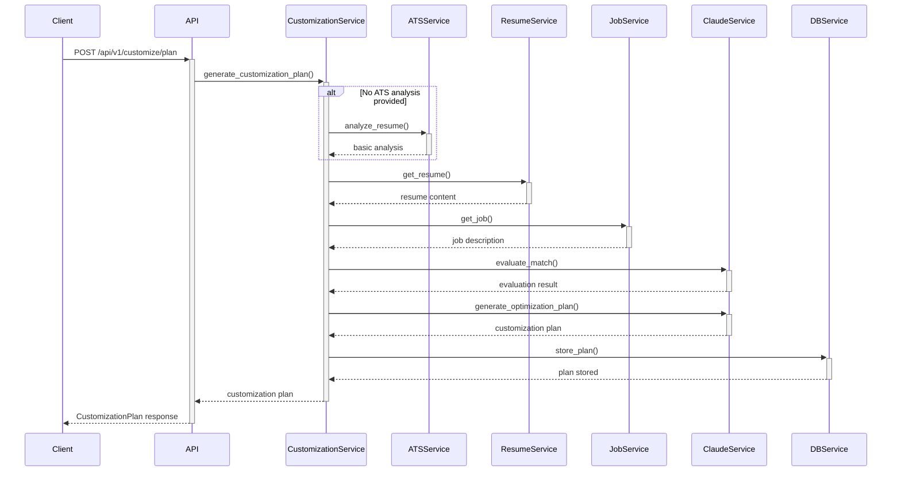

# Evaluator-Optimizer Pattern Implementation Plan

This document outlines a step-by-step blueprint for implementing the evaluator-optimizer pattern in the ResumeAIAssistant backend, following best practices from Anthropic's [Building Effective Agents](https://www.anthropic.com/engineering/building-effective-agents) article.

## Overview

The evaluator-optimizer pattern involves three main components:
1. **Basic Analysis**: Initial assessment of resume and job description (already implemented)
2. **Evaluation**: Claude acting as an ATS expert to evaluate the match
3. **Optimization**: Claude generating a detailed customization plan based on evaluation

## Implementation Breakdown

### Phase 1: Foundation Setup

#### Step 1.1: Backend Models

```
You're implementing models for a resume customization system using the evaluator-optimizer pattern in a FastAPI backend.

Create the following Pydantic models in a file named `models/customization.py`:

1. A `CustomizationLevel` enum with values CONSERVATIVE, BALANCED, and EXTENSIVE (mapped to 1, 2, 3)
2. A `CustomizationPlanRequest` model with fields:
   - resume_id (UUID)
   - job_description_id (UUID)
   - customization_level (CustomizationLevel, defaulting to BALANCED)
   - ats_analysis (Optional Dict)
3. A `RecommendationItem` model with fields:
   - section (str)
   - what (str): what to change
   - why (str): reason for change
   - before_text (Optional str): text before change
   - after_text (Optional str): text after change
   - description (str): detailed explanation
4. A `CustomizationPlan` model with fields:
   - summary (str): overall plan summary
   - job_analysis (str): analysis of job requirements
   - keywords_to_add (List[str]): keywords to incorporate
   - formatting_suggestions (List[str]): formatting improvements
   - recommendations (List[RecommendationItem]): detailed suggestions

Include appropriate type hints, field descriptions, and example values where helpful.
```

#### Step 1.2: Prompt Templates Module

```
Create a module `services/prompts.py` that contains prompt templates for the resume customization feature using the evaluator-optimizer pattern.

Include the following prompt templates:

1. BASIC_RESUME_ANALYSIS_PROMPT:
   A simple prompt for extracting keywords from a resume and job description.

2. EVALUATOR_PROMPT:
   Position Claude as an ATS consultant who will evaluate a resume against a job description.
   - Input: Resume content, job description, basic keyword analysis
   - Output: Expert analysis of resume-job match, strengths, weaknesses, and improvement opportunities

3. OPTIMIZER_PROMPT:
   Position Claude as a resume optimization expert who will create a detailed customization plan.
   - Input: Resume content, job description, evaluation from previous step
   - Output: Structured customization plan with section-by-section recommendations

4. getCustomizationLevelPrompt function:
   Returns specific instructions based on customization level (conservative, balanced, extensive)
   
Each prompt should use clearly marked placeholders like {resume_content}, {job_description}, etc.

Add detailed docstrings explaining the purpose of each prompt and how it should be used.
```

#### Step 1.3: Claude Service

```
Create a service module `services/claude_service.py` for interacting with Claude API.

Implement the following:

1. Install necessary packages:
   - anthropic (for Claude API)
   - pydantic (for data validation)

2. Create a ClaudeService class with:
   - __init__ method that accepts API key and default model (defaulting to "claude-3-opus-20240229")
   - complete_chat method that takes:
     - A list of messages in the format expected by Claude
     - Optional temperature parameter (default 0.7)
     - Optional max_tokens parameter (default 1000)
     - Returns the assistant's response
   - complete_prompt method that takes:
     - A prompt string
     - Optional system instruction
     - Optional temperature and max_tokens
     - Formats as proper chat and calls complete_chat
     - Returns just the assistant's message content

3. Create a factory function get_claude_service() that:
   - Reads API key from environment/settings
   - Returns a ClaudeService instance

Use standard Python best practices, error handling, and async patterns compatible with FastAPI.
```

### Phase 2: Core Implementation

#### Step 2.1: Response Parsing Utilities

```
Create a utility module `utils/claude_parsers.py` for parsing Claude's responses in the resume customization system.

Implement the following functions:

1. parse_evaluation_response(text: str) -> Dict:
   - Parses Claude's evaluation of a resume
   - Extracts key information like overall assessment, strengths, weaknesses
   - Returns a structured dictionary

2. parse_optimization_plan(text: str) -> CustomizationPlan:
   - Parses Claude's optimization plan
   - Extracts summary, job analysis, keywords, formatting suggestions, and recommendations
   - Returns a properly structured CustomizationPlan object

3. Helper utility functions:
   - extract_json_from_text(text: str) -> Dict: Finds and parses JSON in text responses
   - extract_section(text: str, section_name: str) -> str: Extracts a named section from text
   - parse_recommendation_items(recommendations_text: str) -> List[RecommendationItem]

Include robust error handling, as LLM outputs can be unpredictable. Use regex, string manipulation, or other appropriate techniques to reliably extract structured data from text responses.

Add comprehensive docstrings and type hints for all functions.
```

#### Step 2.2: Customization Service - Basic Structure

```
Create a service module `services/customization_service.py` for the resume customization system.

Implement the following:

1. A CustomizationService class with:
   - __init__ method that accepts dependencies:
     - resume_service: for accessing resumes
     - job_service: for accessing job descriptions
     - ats_service: for basic keyword analysis
     - claude_service: for AI-powered analysis
     - db_service: for storing and retrieving plans

2. Method skeletons (implementation will come in later steps):
   - async def generate_customization_plan(self, request: CustomizationPlanRequest) -> CustomizationPlan
   - async def _perform_basic_analysis(self, resume_id: UUID, job_id: UUID) -> Dict
   - async def _evaluate_match(self, resume_content: str, job_description: str, basic_analysis: Dict, level: CustomizationLevel) -> Dict
   - async def _generate_optimization_plan(self, resume_content: str, job_description: str, evaluation: Dict, level: CustomizationLevel) -> CustomizationPlan
   - async def _store_plan(self, user_id: UUID, resume_id: UUID, job_id: UUID, plan: CustomizationPlan) -> None

3. A factory function get_customization_service() that:
   - Gets all required dependencies
   - Returns a CustomizationService instance

Add proper docstrings, type hints, and error handling. Use dependency injection to make the service testable.
```

#### Step 2.3: Basic Analysis Integration

```
Implement the _perform_basic_analysis method in the CustomizationService class you created earlier.

Update the services/customization_service.py file to:

1. Implement the _perform_basic_analysis method that:
   - Takes resume_id and job_id parameters
   - Calls the existing ATS service's analyze_resume method
   - Returns the analysis result
   - Includes appropriate error handling
   - Logs the analysis process

2. Consider edge cases:
   - What if the analysis fails?
   - What if the resume or job doesn't exist?
   - What if the analysis returns unexpected data?

Make sure this implementation builds on the existing ATSService without duplicating functionality.

Use proper async/await syntax and comprehensive error handling with specific exception types.
```

#### Step 2.4: Evaluation Implementation

```
Implement the _evaluate_match method in the CustomizationService class, which uses Claude to evaluate the resume-job match.

Update the services/customization_service.py file to:

1. Complete the _evaluate_match method to:
   - Take resume content, job description, basic analysis, and customization level
   - Format the EVALUATOR_PROMPT from prompts.py with these inputs
   - Get customization level instructions using getCustomizationLevelPrompt
   - Call the Claude service to generate an evaluation
   - Parse the response using parse_evaluation_response from utils/claude_parsers.py
   - Return the structured evaluation

2. Include logging at appropriate points
3. Add proper error handling with specific exception types
4. Add retry logic for API failures

Make sure the method clearly separates concerns: prompt preparation, API interaction, and response parsing.
```

#### Step 2.5: Optimization Implementation

```
Implement the _generate_optimization_plan method in the CustomizationService class, which uses Claude to create a customization plan based on the evaluation.

Update the services/customization_service.py file to:

1. Complete the _generate_optimization_plan method to:
   - Take resume content, job description, evaluation result, and customization level
   - Format the OPTIMIZER_PROMPT from prompts.py with these inputs
   - Include customization level instructions from getCustomizationLevelPrompt
   - Call the Claude service to generate an optimization plan
   - Parse the response using parse_optimization_plan from utils/claude_parsers.py
   - Return a structured CustomizationPlan object

2. Include logging at appropriate points
3. Add proper error handling with specific exception types
4. Add retry logic for API failures

Ensure the method follows the same patterns as _evaluate_match for consistency, focusing on prompt preparation, API interaction, and response parsing.
```

#### Step 2.6: Storage Implementation

```
Implement the _store_plan method in the CustomizationService class, which stores customization plans for future reference.

Update the services/customization_service.py file to:

1. Complete the _store_plan method to:
   - Take user_id, resume_id, job_id, and the CustomizationPlan
   - Create a new record in the database with:
     - user_id: who the plan belongs to
     - resume_id: which resume it's for
     - job_id: which job it's for
     - plan: the full customization plan
     - created_at: timestamp
   - Return the ID of the created plan record

2. Define a schema for storing plans in the database
3. Add error handling for database operations
4. Add logging for successful and failed operations

If you haven't already set up database models:
- Create a CustomizationPlanModel in models/database.py
- Include all necessary fields to match the CustomizationPlan Pydantic model

Ensure proper async patterns are used for database operations.
```

### Phase 3: Integration and API Endpoints

#### Step 3.1: Assemble Main Service Method

```
Implement the main generate_customization_plan method in the CustomizationService class, which orchestrates the entire evaluator-optimizer process.

Update the services/customization_service.py file to:

1. Complete the generate_customization_plan method to:
   - Accept a CustomizationPlanRequest
   - Retrieve the resume and job description using resume_id and job_description_id
   - If ats_analysis is provided in the request, use it; otherwise, call _perform_basic_analysis
   - Call _evaluate_match with resume content, job description, analysis, and customization level
   - Call _generate_optimization_plan with resume, job, evaluation, and level
   - Call _store_plan to persist the plan if applicable
   - Return the CustomizationPlan

2. Add proper logging throughout the process
3. Include comprehensive error handling with specific exception types
4. Add timing/performance metrics

Make sure the method clearly orchestrates the evaluator-optimizer pattern:
- Basic analysis (either provided or generated)
- Evaluation by Claude (ATS expert perspective)
- Optimization plan generation (structured recommendations)
```

#### Step 3.2: API Endpoint Creation

```
Create an API endpoint for the customization plan feature in the FastAPI backend.

Update the routes/customization.py file (or create it if it doesn't exist) to:

1. Create a POST endpoint at /api/v1/customize/plan that:
   - Accepts a CustomizationPlanRequest
   - Uses dependency injection to get current_user and customization_service
   - Calls customization_service.generate_customization_plan
   - Returns the resulting CustomizationPlan
   - Is properly documented with OpenAPI information

2. Include appropriate error handling:
   - Return 400 for invalid requests
   - Return 404 for missing resources
   - Return 500 for service errors
   - Include helpful error messages

3. Ensure proper authentication middleware is applied
4. Add rate limiting if appropriate

If you need to register this router in the main application:
- Update the main app file to include this router
- Mount it at the correct prefix
```

#### Step 3.3: Testing Setup

```
Create unit and integration tests for the customization service and API endpoint.

Create test files:

1. tests/unit/services/test_customization_service.py:
   - Test for each individual method in the CustomizationService
   - Mock all dependencies (resume_service, job_service, ats_service, claude_service, db_service)
   - Verify correct calls to dependencies
   - Verify correct processing of responses
   - Test error handling

2. tests/integration/test_customization_api.py:
   - Test the full API endpoint
   - Create test fixtures for database objects
   - Mock external calls to Claude API
   - Test both successful scenarios and error cases
   - Verify response structure matches expected CustomizationPlan

For both test files, include:
- Setup and teardown functions
- Fixtures for test data
- Comprehensive test coverage of edge cases
- Clear test function names describing what's being tested

Follow standard pytest best practices for FastAPI applications.
```

### Phase 4: Refinement and Deployment

#### Step 4.1: Logging and Monitoring

```
Implement comprehensive logging and monitoring for the customization service.

Update the services/customization_service.py and related files to:

1. Add structured logging throughout the service:
   - Log the start and end of each method with appropriate context
   - Log key parameters (sanitized for privacy)
   - Log performance metrics (timing for each step)
   - Log any warnings or unexpected conditions

2. Add monitoring points:
   - Track success/failure rates
   - Track latency for each step
   - Track Claude API usage
   - Track overall service usage

3. Create helper functions for consistent logging

If you have a centralized logging system:
- Ensure the customization service integrates with it
- Define appropriate log levels
- Add request IDs for traceability

Ensure logs are useful for both debugging and business analytics.
```

#### Step 4.2: Error Handling Improvements

```
Enhance error handling throughout the customization service for better reliability and user experience.

Update the services/customization_service.py and related files to:

1. Create custom exception classes:
   - AnalysisError for issues with basic analysis
   - EvaluationError for issues with the evaluation step
   - OptimizationError for issues with plan generation
   - StorageError for database issues

2. Implement graceful fallbacks:
   - If claude service fails, fall back to basic analysis results
   - If parse_evaluation_response fails, make a second attempt with looser parsing
   - If _store_plan fails, log but don't fail the entire request

3. Add retry mechanisms:
   - Retry Claude API calls with exponential backoff
   - Retry database operations when appropriate

4. Improve error responses:
   - Map internal errors to appropriate HTTP status codes
   - Provide helpful error messages without exposing sensitive details
   - Include troubleshooting information when possible

Ensure error handling is consistent across all components of the service.
```

#### Step 4.3: Performance Optimization

```
Optimize the performance of the customization service for better user experience.

Update the services/customization_service.py and related files to:

1. Implement caching:
   - Cache basic analysis results
   - Cache Claude evaluation results for similar inputs
   - Use Redis or a similar solution for distributed caching

2. Optimize Claude API usage:
   - Ensure prompts are as concise as possible
   - Use the appropriate Claude model for each task
   - Implement response streaming if appropriate

3. Add parallelization:
   - Fetch resume and job description in parallel
   - Run independent operations concurrently

4. Add timeout handling:
   - Set appropriate timeouts for all external calls
   - Provide fallbacks for timeout scenarios

Measure the performance impact of each optimization to ensure it's effective.
```

#### Step 4.4: Documentation and Integration

```
Complete the documentation and integration for the customization service.

1. Update OpenAPI documentation:
   - Add detailed descriptions for the /api/v1/customize/plan endpoint
   - Document all request and response models
   - Include example requests and responses
   - Document error responses

2. Create developer documentation:
   - Update README.md with information about the new service
   - Document the evaluator-optimizer pattern implementation
   - Include architecture diagrams
   - Provide usage examples

3. Update frontend integration (if needed):
   - Make sure the frontend client.ts is correctly calling the new endpoint
   - Update any TypeScript interfaces to match the backend models
   - Add appropriate error handling on the frontend

4. Create admin documentation:
   - Document configuration options
   - Provide monitoring guidance
   - Include troubleshooting tips

Ensure documentation is comprehensive enough for both new and experienced developers.
```

## Sequence Diagram



## Final Considerations

- **Testing**: Prioritize thorough testing at each stage
- **Monitoring**: Implement comprehensive logging and analytics
- **Graceful degradation**: Ensure the system can fall back to simpler analyses if advanced features fail
- **Documentation**: Keep API docs and developer resources updated
- **Performance**: Monitor and optimize response times
- **Feedback loop**: Collect data on the effectiveness of customization plans

---

This implementation roadmap follows an incremental approach, with each step building on the previous ones. The evaluator-optimizer pattern is implemented with Claude serving as both the evaluator (ATS expert) and optimizer (customization plan generator), with appropriate prompting to guide each role.