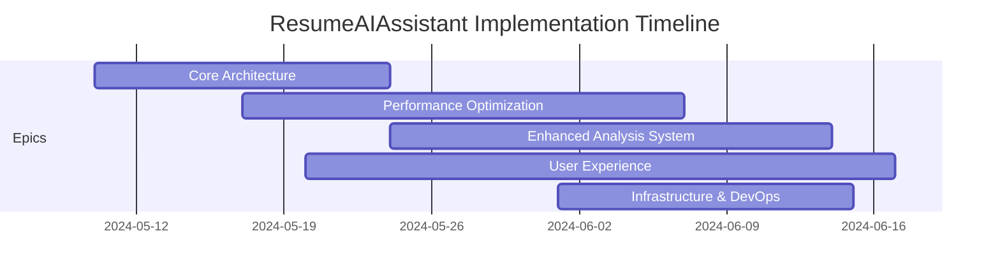

# ResumeAIAssistant Optimized Project Plan

## Epic Structure and Parallelization Strategy

This document reorganizes the development plan to optimize for parallel work across multiple developers or AI agents, with clear dependencies and task boundaries.

## Project Epics

### Epic 1: Core Architecture Improvements
Focus on foundational improvements that enable other work to proceed in parallel.

### Epic 2: Performance Optimization
Improve processing speed and efficiency through parallelization and optimization.

### Epic 3: Enhanced Analysis System
Improve the evaluator-optimizer pattern and analysis capabilities.

### Epic 4: User Experience & Frontend Enhancements
Improve the UI/UX for visualization, feedback, and interaction.

### Epic 5: Infrastructure & DevOps
Enhance deployment, monitoring, and maintenance capabilities.

## Implementation Timeline

## Detailed Task Breakdown

### Epic 1: Core Architecture Improvements (2 weeks)

#### Issue #1: Feature Flag System
- **Description**: Implement configuration-based feature toggling to enable/disable features
- **Tasks**:
  - [ ] Design feature flag schema and configuration structure
  - [ ] Implement feature flag middleware in backend
  - [ ] Create admin interface controls for feature management
  - [ ] Move cover letter functionality behind feature flag
- **Dependencies**: None
- **Estimate**: 3 days
- **Parallelization**: Can be worked on independently

#### Issue #2: Model Configuration Enhancement
- **Description**: Create structured schema for AI model capabilities and selection
- **Tasks**:
  - [ ] Design model capability and cost schema
  - [ ] Implement dynamic model fallback chains
  - [ ] Add cost monitoring and budget constraints
  - [ ] Create configuration interface for model settings
- **Dependencies**: None
- **Estimate**: 4 days
- **Parallelization**: Can be worked on independently

#### Issue #3: Backend API Refactoring
- **Description**: Refactor API layer to support parallel processing and enhanced features
- **Tasks**:
  - [ ] Design updated API endpoints for parallel operations
  - [ ] Implement background task handling with status tracking
  - [ ] Create WebSocket endpoints for real-time progress updates
  - [ ] Add proper error handling and recovery mechanisms
- **Dependencies**: None
- **Estimate**: 5 days
- **Parallelization**: Can be worked on independently after API design is finalized

#### Issue #4: Data Model Enhancements
- **Description**: Update data models to support new features and optimizations
- **Tasks**:
  - [ ] Add progress tracking fields to existing models
  - [ ] Create models for storing analysis components and results
  - [ ] Add versioning support for resume customizations
  - [ ] Implement caching structure for intermediate results
- **Dependencies**: None
- **Estimate**: 3 days
- **Parallelization**: Can be worked on independently

### Epic 2: Performance Optimization (3 weeks)

#### Issue #5: Parallel Processing Architecture
- **Description**: Design and implement parallel workflow for analysis and implementation
- **Tasks**:
  - [ ] Design section-based parallelization approach
  - [ ] Create task scheduler for managing parallel model requests
  - [ ] Implement resume section splitter and combiner
  - [ ] Add error recovery and fallback mechanisms
- **Dependencies**: #3 (Backend API Refactoring)
- **Estimate**: 5 days
- **Parallelization**: Core task that should be assigned to a single developer

#### Issue #6: Progress Tracking Enhancement
- **Description**: Improve progress tracking and estimation systems
- **Tasks**:
  - [ ] Replace basic progress bar with detailed step tracking
  - [ ] Add accurate time estimation based on task complexity
  - [ ] Implement state persistence for long-running tasks
  - [ ] Create notification system for process completion
- **Dependencies**: #3 (Backend API Refactoring), #4 (Data Model Enhancements)
- **Estimate**: 4 days
- **Parallelization**: Can be worked on in parallel with Issue #5

#### Issue #7: Token and Cost Optimization
- **Description**: Optimize token usage and implement cost-saving measures
- **Tasks**:
  - [ ] Update model selector to use cheaper models for non-critical tasks
  - [ ] Create tiered processing approach based on task importance
  - [ ] Implement token optimization techniques across all processes
  - [ ] Add cost tracking and reporting system
- **Dependencies**: #2 (Model Configuration Enhancement)
- **Estimate**: 4 days
- **Parallelization**: Can be worked on in parallel with Issues #5 and #6

#### Issue #8: Caching and Optimization System
- **Description**: Implement caching and optimization for better performance
- **Tasks**:
  - [ ] Design caching strategy for resumable operations
  - [ ] Implement debouncing for rapid sequential operations
  - [ ] Add preprocessing to reduce token usage
  - [ ] Create optimization presets for different speed/quality tradeoffs
- **Dependencies**: #4 (Data Model Enhancements)
- **Estimate**: 5 days
- **Parallelization**: Can be worked on in parallel with other performance tasks

### Epic 3: Enhanced Analysis System (3 weeks)

#### Issue #9: Specialized Resume Analyzers
- **Description**: Create specialized parallel analyzers for different resume aspects
- **Tasks**:
  - [ ] Implement skills and qualifications analyzer
  - [ ] Create experience alignment analyzer
  - [ ] Add education and certification relevance analyzer
  - [ ] Develop achievement quantification analyzer
  - [ ] Build language and tone optimization analyzer
- **Dependencies**: #5 (Parallel Processing Architecture)
- **Estimate**: 7 days
- **Parallelization**: Each analyzer can be developed independently once the framework is in place

#### Issue #10: Analysis Synthesis Component
- **Description**: Create system to combine results from specialized analyzers
- **Tasks**:
  - [ ] Design result aggregation schema
  - [ ] Implement priority and conflict resolution algorithms
  - [ ] Create comprehensive analysis report generator
  - [ ] Add confidence scoring for recommendations
- **Dependencies**: #9 (Specialized Resume Analyzers)
- **Estimate**: 4 days
- **Parallelization**: Must follow specialized analyzers

#### Issue #11: Verification Component
- **Description**: Add verification step to workflow for quality control
- **Tasks**:
  - [ ] Design verification prompts and evaluation metrics
  - [ ] Implement consistency checking between sections
  - [ ] Create rejection handling and refinement loops
  - [ ] Add summary reports of verification results
- **Dependencies**: #10 (Analysis Synthesis Component)
- **Estimate**: 5 days
- **Parallelization**: Must follow synthesis component

#### Issue #12: Reflective Optimization System
- **Description**: Implement feedback loops in the optimization process
- **Tasks**:
  - [ ] Create self-critique mechanism for proposed changes
  - [ ] Add adaptive prompting based on resume complexity
  - [ ] Implement alternative solution generation
  - [ ] Develop optimization strategy selection logic
- **Dependencies**: #11 (Verification Component)
- **Estimate**: 5 days
- **Parallelization**: Must follow verification component

### Epic 4: User Experience & Frontend Enhancements (4 weeks)

#### Issue #13: Improved Diff Visualization
- **Description**: Enhance diff visualization for better comparison of changes
- **Tasks**:
  - [ ] Research and select appropriate diff visualization library
  - [ ] Implement side-by-side or inline comparison with better highlighting
  - [ ] Create summary view of changes by section
  - [ ] Add toggles between different visualization modes
  - [ ] Ensure mobile-friendly responsive diff display
- **Dependencies**: None (can start immediately)
- **Estimate**: 5 days
- **Parallelization**: Can be worked on independently by a frontend developer

#### Issue #14: Resume Review and Editing Interface
- **Description**: Create interactive review and editing capabilities
- **Tasks**:
  - [ ] Add ability to accept/reject individual changes
  - [ ] Create interactive editing capability for customized resumes
  - [ ] Implement guided editing with AI suggestions
  - [ ] Add version history and comparison tools
- **Dependencies**: #13 (Improved Diff Visualization)
- **Estimate**: 7 days
- **Parallelization**: Should follow diff visualization improvements

#### Issue #15: Progress and Notification System (Frontend)
- **Description**: Implement frontend components for progress tracking
- **Tasks**:
  - [ ] Create detailed progress visualization components
  - [ ] Implement estimated time remaining display
  - [ ] Add browser notification system for completion
  - [ ] Create email notification settings interface
- **Dependencies**: #6 (Progress Tracking Enhancement)
- **Estimate**: 4 days
- **Parallelization**: Can be worked on in parallel with other frontend tasks once backend is ready

#### Issue #16: Enhanced Results Visualization
- **Description**: Improve presentation of customization results
- **Tasks**:
  - [ ] Create more visually appealing resume comparison view
  - [ ] Add keyword highlighting in customized resume
  - [ ] Implement expandable sections for detailed analysis
  - [ ] Add visual indicators for strength of improvements
- **Dependencies**: #13 (Improved Diff Visualization)
- **Estimate**: 5 days
- **Parallelization**: Can follow or partially overlap with diff visualization implementation

#### Issue #17: User Flow Optimization
- **Description**: Refine the overall user experience and flows
- **Tasks**:
  - [ ] Refine resume and job selection components
  - [ ] Add sample resumes and job descriptions for new users
  - [ ] Implement guided tutorial for first-time users
  - [ ] Create clearer navigation between steps
- **Dependencies**: None (can start immediately)
- **Estimate**: 5 days
- **Parallelization**: Can be worked on independently by a frontend developer

### Epic 5: Infrastructure & DevOps (2 weeks)

#### Issue #18: Security and Compliance Enhancements
- **Description**: Improve security features and compliance capabilities
- **Tasks**:
  - [ ] Enhance data handling for personal information
  - [ ] Implement content filtering for inappropriate content
  - [ ] Add rate limiting and abuse prevention
  - [ ] Create comprehensive error handling and monitoring
- **Dependencies**: None (can start immediately)
- **Estimate**: 5 days
- **Parallelization**: Can be worked on independently

#### Issue #19: Deployment Pipeline Improvements
- **Description**: Enhance deployment and CI/CD processes
- **Tasks**:
  - [ ] Set up automated testing for all new components
  - [ ] Create deployment pipeline for staged releases
  - [ ] Implement feature flag integration with deployments
  - [ ] Add monitoring and alerting for production issues
- **Dependencies**: #1 (Feature Flag System)
- **Estimate**: 4 days
- **Parallelization**: Can be worked on independently after feature flag system

#### Issue #20: Documentation and Training
- **Description**: Create comprehensive documentation for the system
- **Tasks**:
  - [ ] Update API documentation with new endpoints
  - [ ] Create internal developer documentation
  - [ ] Update user guides and help resources
  - [ ] Create training materials for new features
- **Dependencies**: All features should be defined (but not necessarily implemented)
- **Estimate**: 5 days
- **Parallelization**: Can be worked on throughout development cycle, with final updates at the end

## Parallelization Matrix

| Team/Developer Role | Primary Issues | Secondary Issues | Can Start Immediately |
|---------------------|----------------|-------------------|------------------------|
| Backend Lead        | #3, #5         | #7, #11           | Yes (#3)               |
| Backend Developer 1 | #4, #8         | #6, #10           | Yes (#4)               |
| Backend Developer 2 | #1, #2         | #9, #12           | Yes (#1, #2)           |
| Frontend Lead       | #13, #14       | #16               | Yes (#13)              |
| Frontend Developer  | #15, #17       | #16               | Yes (#17)              |
| DevOps Engineer     | #18, #19       | #20               | Yes (#18)              |

## Implementation Strategy

1. **Start with foundation** (Week 1-2):
   - Begin Core Architecture tasks immediately
   - These enable other work to proceed without blocking

2. **Parallel streams** (Week 3-4):
   - Backend team focused on performance optimization
   - Frontend team working on UI/UX improvements
   - Both can proceed independently based on agreed interfaces

3. **Enhanced features** (Week 5-6):
   - Implement advanced analysis components
   - Continue frontend refinements
   - Begin infrastructure improvements

4. **Integration and polish** (Week 7-8):
   - Connect enhanced backend capabilities with frontend
   - Complete verification and optimization systems
   - Finalize documentation and deployment pipeline

## Critical Path Analysis

The most critical dependency chain is:
1. Backend API Refactoring (#3)
2. Parallel Processing Architecture (#5)
3. Specialized Resume Analyzers (#9)
4. Analysis Synthesis Component (#10)
5. Verification Component (#11)
6. Reflective Optimization System (#12)

This path should be carefully monitored to prevent project delays.

## Risk Mitigation

1. **Technical risks**:
   - Begin parallel processing architecture early to identify any unforeseen challenges
   - Create well-defined interfaces between components to minimize integration issues
   - Implement feature flags to allow graceful degradation if components aren't ready

2. **Resource constraints**:
   - Prioritize core architecture and performance improvements
   - Consider disabling cover letter functionality temporarily to focus efforts
   - Use feature flags to roll out capabilities incrementally

3. **Quality assurance**:
   - Implement the verification component early to catch issues with AI-generated content
   - Create comprehensive automated tests for all new components
   - Consider A/B testing for significant UX changes

## Conclusion

This restructured plan optimizes for parallel development by:
1. Clearly separating backend and frontend concerns
2. Identifying independent work streams that can proceed simultaneously
3. Highlighting critical dependencies that require careful sequencing
4. Providing reasonable time estimates for planning purposes
5. Organizing work into logical epics for easier tracking and management

By following this approach, the development team can make efficient progress without unnecessary blocking, while ensuring that all components integrate properly at the end.